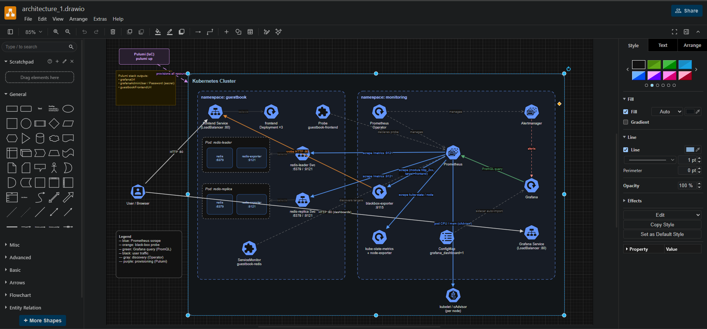

# Guestbook + Monitoring (Pulumi / TypeScript)

Extends the canonical [Pulumi Kubernetes Guestbook](https://github.com/pulumi/examples/tree/master/kubernetes-ts-guestbook/simple)
with a complete Prometheus + Grafana monitoring stack, deployed entirely with Pulumi.

| Requirement | How it's met |
|---|---|
| Deploy Prometheus & Grafana | `kube-prometheus-stack` Helm chart (Prometheus Operator, Prometheus, Grafana, node-exporter, kube-state-metrics) |
| Scrape the **backend** | `redis-exporter` sidecar on each redis pod + a `ServiceMonitor` |
| Scrape the **frontend** | Black-box HTTP `Probe` (availability / latency / status) + cAdvisor pod CPU & memory |
| Expose Grafana | `LoadBalancer` service (or `NodePort` on minikube) |
| Output access details | `pulumi stack output` returns the Grafana URL + admin credentials |
| Stretch: dashboard | A provisioned **Guestbook** dashboard auto-loaded into Grafana |

---

## Architecture



> Editable source: [`diagrams/architecture.drawio`](diagrams/architecture.drawio) (open at [app.diagrams.net](https://app.diagrams.net)).

Prometheus scrapes the redis `redis-exporter` sidecars via a `ServiceMonitor`, and scrapes the `blackbox-exporter` — which in turn probes the frontend Service — via a `Probe`. Grafana queries Prometheus and auto-imports the dashboard from a labelled ConfigMap. Everything is provisioned by Pulumi.

### Why the frontend is monitored differently from the backend

The redis tier is instrumented directly: a `redis-exporter` sidecar in each pod
turns redis `INFO` into Prometheus metrics (commands processed = request rate,
connected clients, keyspace size, memory), scraped via a `ServiceMonitor`.

The frontend image (`pulumi/guestbook-php-redis`) exposes **no** native
`/metrics` endpoint, so a `ServiceMonitor` would have nothing to scrape. Rather
than fake it, the frontend is monitored the way an SRE monitors any opaque or
third-party service:

* **Black-box probing** — a Prometheus-Operator `Probe` points the
  `blackbox-exporter` at the frontend Service, yielding `probe_success`
  (availability), `probe_duration_seconds` (latency) and `probe_http_status_code`.
* **Resource usage** — per-pod CPU and memory come free from cAdvisor, which
  `kube-prometheus-stack` already scrapes; the dashboard filters them to
  `pod=~"frontend.*"`.

### One gotcha worth calling out

`kube-prometheus-stack` defaults to only discovering `ServiceMonitor`s/`Probe`s
that carry its own Helm release label. Custom targets silently never get
scraped as a result. This program sets
`serviceMonitorSelectorNilUsesHelmValues: false` (and the pod/probe/rule
equivalents) so Prometheus discovers our resources cluster-wide.

---

## Prerequisites

* A running Kubernetes cluster and a working `kubectl` context
  (EKS/GKE/AKS for `LoadBalancer`, or minikube/kind with `isMinikube=true`).
* [Pulumi CLI](https://www.pulumi.com/docs/install/) and Node.js 18+.
* [Helm](https://helm.sh/docs/intro/install/) available on PATH (Pulumi's Helm
  Release provider shells out to it).

The program uses your ambient kubeconfig (`kubectl config current-context`).

---

## Deploy

```bash
npm install

# First time only — create/select a stack:
pulumi stack init dev

# Optional: set a Grafana admin password (otherwise defaults to "prom-operator")
pulumi config set --secret grafanaAdminPassword 'YourStrongPassword'

# minikube / no LoadBalancer support? exposes Grafana + frontend via NodePort:
pulumi config set isMinikube true

pulumi up
```

Teardown:

```bash
pulumi destroy
```

---

## Grafana access

After `pulumi up` completes:

```bash
pulumi stack output grafanaUrl
pulumi stack output grafanaAdminUser
pulumi stack output grafanaAdminPassword --show-secrets
```

* **URL:** value of `grafanaUrl` (a LoadBalancer can take a minute to get an
  external address; if it shows `PENDING`, re-run the command shortly after).
* **Username:** `admin`
* **Password:** `prom-operator` by default, or whatever you set via
  `pulumi config set --secret grafanaAdminPassword`.

The `guestbookFrontendUrl` output gives the Guestbook UI address — open it and
sign a few entries to generate redis traffic.

**minikube:** `LoadBalancer` IPs stay pending, so:

```bash
minikube service kube-prometheus-stack-grafana -n monitoring --url   # Grafana
minikube service frontend -n guestbook --url                         # Guestbook UI
```

---

## Verify metrics are being scraped

**1. Check the Prometheus targets are UP.**

```bash
kubectl port-forward -n monitoring svc/kube-prometheus-stack-prometheus 9090:9090
```

Open <http://localhost:9090/targets> — you should see the
`guestbook-redis` ServiceMonitor targets and the `guestbook-frontend-blackbox`
probe target, all `UP`.

**2. Query a backend metric** (Prometheus UI → Graph, or `/api/v1/query`):

```promql
rate(redis_commands_processed_total{namespace="guestbook"}[5m])
redis_connected_clients{namespace="guestbook"}
redis_db_keys{namespace="guestbook"}
```

**3. Query the frontend probe:**

```promql
probe_success{job="guestbook-frontend-blackbox"}        # 1 = up
probe_http_status_code{job="guestbook-frontend-blackbox"}
sum by (pod) (rate(container_cpu_usage_seconds_total{namespace="guestbook", pod=~"frontend.*"}[5m]))
```

**4. Confirm the redis exporters directly (optional):**

```bash
kubectl port-forward -n guestbook svc/redis-leader 9121:9121
curl -s localhost:9121/metrics | grep redis_commands_processed_total
```

---

## Stretch goal — the dashboard

A dashboard titled **"Guestbook — Application Monitoring"** is shipped as a
labelled `ConfigMap` (`grafana_dashboard: "1"`) and auto-imported by Grafana's
provisioning sidecar — no manual import. Find it in Grafana under
**Dashboards → Guestbook — Application Monitoring**. Panels:

* Frontend: availability, HTTP status code, probe latency, pod CPU, pod memory.
* Redis: commands/sec (request rate), connected clients, keys, memory used.

The dashboard JSON lives at [`dashboards/guestbook-dashboard.json`](dashboards/guestbook-dashboard.json)
and uses a `datasource` template variable, so it binds to whatever Prometheus
datasource Grafana provisions.

These panels are deliberately framed as candidate **SLIs**: `probe_success` is an
availability SLI for the frontend, `probe_duration_seconds` is a latency SLI, and
redis command rate / error counts describe backend health. The natural next step
(below) is to attach **SLOs** and burn-rate alerts to them so the dashboard
reflects what actually matters to a customer rather than raw resource counters.

---

## Project layout

```
.
├── index.ts                          # entrypoint: namespaces, wiring, outputs
├── monitoring.ts                     # kube-prometheus-stack, blackbox exporter, dashboard, Grafana URL
├── guestbook.ts                      # guestbook app + redis-exporter sidecars + ServiceMonitor + Probe
├── dashboards/guestbook-dashboard.json
├── Pulumi.yaml
├── package.json
└── tsconfig.json
```

## Notes / things I'd do next with more time

* **Define SLOs + burn-rate alerts.** Turn the SLIs above into SLOs (e.g. 99.5%
  frontend availability, p95 latency target) and add multi-window burn-rate
  `PrometheusRule`s wired to Alertmanager — alerting on error budget, not noise.
* **Add Loki for logs.** Deploy Loki + Promtail and correlate frontend/redis logs
  with the metrics in Grafana, so an alert links straight to the relevant logs.
* **Deliver via GitOps.** Pair this Pulumi-provisioned platform with a pull-based
  GitOps workflow (ArgoCD or Flux) for in-cluster app manifests, keeping every
  change declarative and version-controlled.
* Pin the chart versions (left unpinned here so it deploys against a fresh repo;
  the `version:` field is commented in `monitoring.ts` showing where).
* Put Grafana behind an Ingress + TLS instead of a raw LoadBalancer.
* Add a horizontal pod autoscaler on the frontend driven by request-rate metrics.
